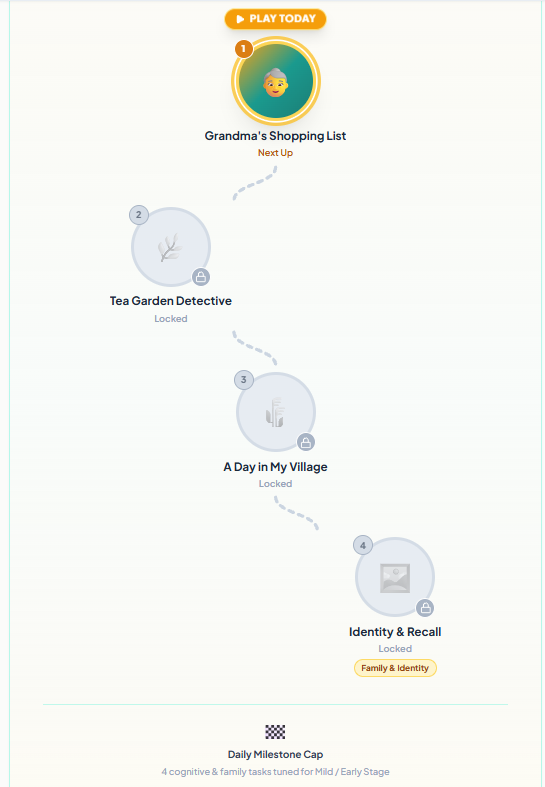
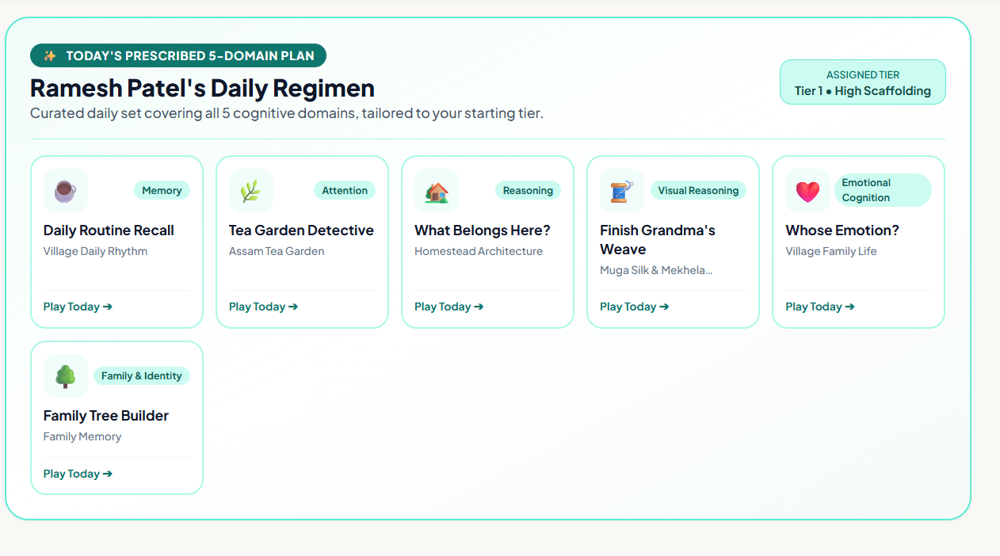
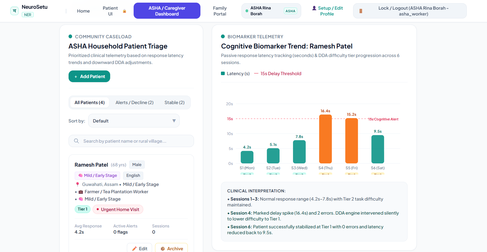
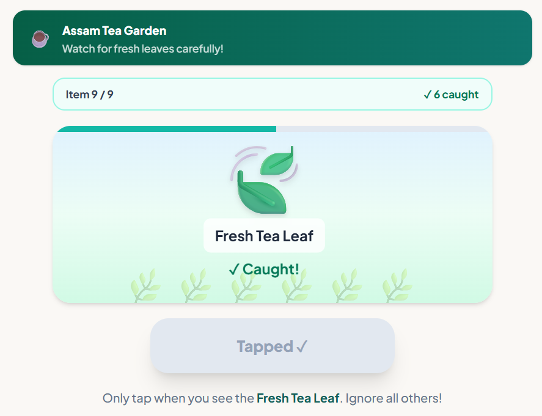
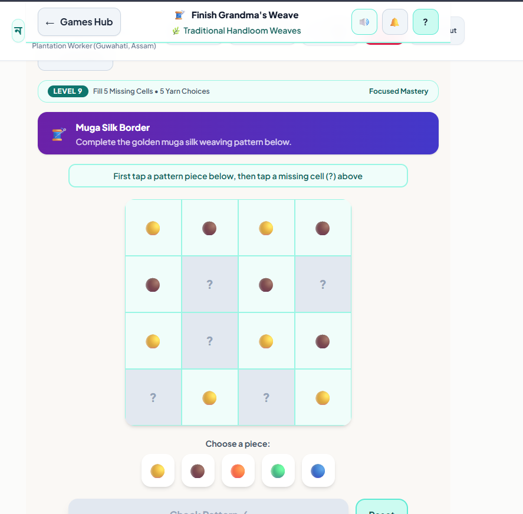
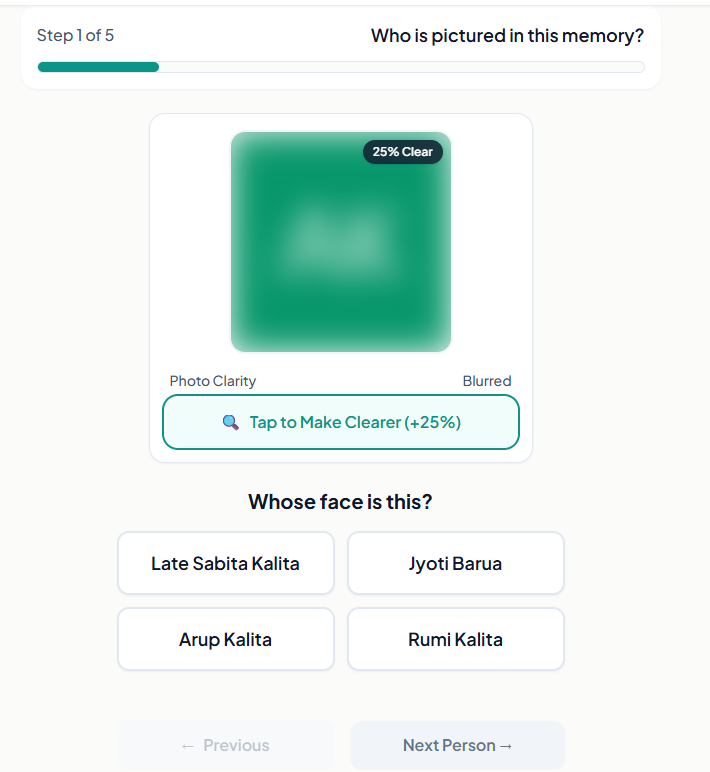

<div align="center">

# 🧠 NeuroSetu (নিউৰ'সেতু / নিউরোসেতু / न्यूरोसेतु)
### Offline-First Cognitive Care & Memory Assistance PWA for Elderly Dementia in North-East India

*Bridging the healthcare divide with culturally resonant, local-first digital therapeutics for patients, caregivers, and frontline ASHA workers.*

[](https://www.sih.gov.in/)
[](https://www.sih.gov.in/)
[](https://web.dev/progressive-web-apps/)
[](https://react.dev/)
[](https://vitejs.dev/)
[](https://tailwindcss.com/)
[](https://supabase.com/)

**[🚀 Live Production Demo](https://neurosetu-synaptyx.vercel.app/)** · **[🎥 Intro Video Walkthrough](#-video-walkthrough)** · **[🏗 Architecture](./ARCHITECTURE.md)** · **[🎨 UI/UX Design System](./DESIGN.md)** · **[📄 Product Requirements](./PRD.md)**

</div>

---

## 🎥 Video Walkthrough

*A quick walkthrough highlighting our problem statement, field constraints in Northeast India, and the NeuroSetu offline-first experience:*

https://github.com/user-attachments/assets/90a24634-92fc-4ec2-aefe-0f72255e1ce9

---

## 🌏 Mission & Regional Context

In the **North-Eastern Region (NER) of India**, rural communities face acute structural barriers in managing Mild Cognitive Impairment (MCI), Alzheimer's disease, and late-stage dementia:
- **Geographic & Clinical Remoteness:** Specialist neurologists, geriatricians, and memory clinics are concentrated in a handful of major medical hubs (e.g., Guwahati, Imphal, Shillong), requiring arduous travel for rural elders.
- **Intermittent Connectivity:** Rural hilly terrains frequently suffer from network blackouts and 2G/3G throttled bandwidth.
- **Cultural & Linguistic Alienation:** Existing digital cognitive assessment platforms are almost exclusively in English, rely on Western cultural paradigms (e.g., matching Western cutlery or unfamiliar urban symbols), and demand high digital literacy.
- **Under-equipped Frontline Cadres:** Accredited Social Health Activists (ASHA) and Anganwadi workers lack standardized, easy-to-deploy digital tools to screen, track, and support families locally.

> **NeuroSetu** (*Setu* = bridge) connects rural Northeast families with evidence-based cognitive stimulation therapy that works **100% offline**, respects local dialects and folklore, and arms ASHA workers with actionable longitudinal telemetry.

---

## 🌟 Core Features

### 1. 📴 Offline-First PWA Architecture
- **Zero-Connectivity Resilience:** Powered by **Workbox** and a strict Service Worker caching strategy. The complete app shell, fonts, audio clips, and 15 games load instantly even in airplane mode.
- **Local-First Telemetry (IndexedDB):** All session scores, gameplay timestamps, reaction latencies, and error patterns are persisted client-side via `idb`. When internet connectivity resumes, a non-blocking background queue syncs telemetry to **Supabase (PostgreSQL)** with optimistic updates.

### 2. 🗣️ Multi-Language Voice Guidance & Audio Prompts
- Voice guidance tailored for regional dialects including **Assamese (অসমীয়া)**, **Bengali (বাংলা)**, **Manipuri (মৈতৈলোন্ / Meiteilon)**, and **Hindi (हिन्दी)** alongside English.
- Integrated text-to-speech cues and natural voice prompts reduce cognitive burden for illiterate or visually fatigued elders.

### 3. 👁️ High-Contrast Accessible Design System
- Built to strict **WCAG 2.1 AAA** contrast standards.
- Senior-friendly tactile controls: minimum **48×48px tap targets**, oversized typography (`Noto Sans Bengali`, `Noto Sans Devanagari`, `Source Sans 3`), gentle haptics, and zero cluttered animations.
- **Gentle Idle Auto-Lock:** Protects confidential elder records when tablets or mobile devices are shared in community centers or joint households.

### 4. 🌾 Culturally Grounded Cognitive Games
15 clinically inspired cognitive games mapped across 5 core neurological domains:

| Domain | Cognitive Focus | Cultural Theme & Game Modules |
|:---|:---|:---|
| 🧠 **Memory Training** | Immediate recall, working memory, spatial orientation | *Festival Memory Match* (Bihu, Durga Puja, Ningol Chakouba), *Grandma's Shopping List*, *Village Path Home*, *Daily Routine Recall*, *Remember the Story*, *Whose Morning Is It?* |
| 👁️ **Attention & Focus** | Selective attention, visual search | *Tea Garden Detective* (spotting regional flora/tools), *Find the Difference* |
| 💡 **Reasoning & Planning** | Categorization, executive function | *Pack the Village Basket*, *What Belongs Here?*, *A Day in My Village*, *Care for Your Companion* |
| 🎨 **Visual & Spatial** | Pattern completion, motor coordination | *Finish Grandma's Weave* (traditional Mekhela Chador & handloom patterns) |
| 👪 **Family & Reminiscence** | Emotional anchors, facial recognition | *Identity & Recall* (family photo recognition), *Family Tree Builder*, *Category Sorting*, *Life Story Timeline* |

### 5. 🩺 Clinical Triage & ASHA Worker Dashboard
- **Role-Based Workflows:** Simplified 6-digit PIN login for seniors; secure authenticated portal for ASHA workers and family caregivers.
- **Longitudinal Trend Tracking:** ASHA workers can review daily completion rates, cognitive decline flags, and assign customized regional content packs.
- **Family Remote Engagement:** Family members can upload local photos and voice notes into memory games, strengthening emotional resilience.

---

## 🏗️ System Architecture

```
┌─────────────────────────────────────────────────────────────┐
│                 Client-Side React 18 + Vite PWA             │
│   Accessible UI (Tailwind) · 15 Cognitive Games · Voice TTS │
└───────────────┬─────────────────────────────┬───────────────┘
                │                             │
       (Service Worker)              (Telemetry Writes)
                ▼                             ▼
   ┌─────────────────────────┐   ┌───────────────────────────┐
   │    Workbox Cache        │   │    IndexedDB (`idb`)      │
   │  App Shell, Regional    │   │  Local-First Session Logs │
   │  Fonts, Audio Assets    │   │  Offline Queue & Profiles │
   └─────────────────────────┘   └─────────────┬─────────────┘
                                               │
                                     (Background Reconciler)
                                               │ [When Online]
                                               ▼
                                 ┌───────────────────────────┐
                                 │     Supabase Backend      │
                                 │  PostgreSQL · Auth · RLS  │
                                 └───────────────────────────┘
```

---

## 🛠️ Tech Stack

| Domain | Technology | Justification |
|:---|:---|:---|
| **Frontend Framework** | [React 18](https://react.dev/) + [Vite 5](https://vitejs.dev/) | Ultra-fast build times, modular component trees, zero-overhead hydration |
| **Styling & A11y** | [Tailwind CSS 3.4](https://tailwindcss.com/) | Low runtime footprint, precision control over high-contrast color palettes |
| **Offline Engine** | [Vite PWA Plugin](https://vite-pwa-org.netlify.app/) & [Workbox](https://developer.chrome.com/docs/workbox) | Service worker precaching, stale-while-revalidate runtime caching |
| **Local Storage** | [IndexedDB (`idb`)](https://github.com/jakearchibald/idb) | Uncapped structured client-side storage for offline game history |
| **Remote Database** | [Supabase](https://supabase.com/) ([PostgreSQL](https://www.postgresql.org/)) | Row Level Security (RLS), patient isolation, and seamless REST/realtime APIs |
| **Typography** | `@fontsource/noto-sans-bengali`, `@fontsource/noto-sans-devanagari` | Crisp native rendering for regional Indic scripts |
| **Icons & Media** | [Lucide React](https://lucide.dev/) | Clean, semantic iconography for low-cognitive-load navigation |
| **Testing** | [Vitest](https://vitest.dev/) & [Testing Library](https://testing-library.com/) | Blazing-fast headless testing of game engines and sync logic |
| **Deployment** | [Vercel](https://vercel.com/) | Global edge delivery with automated HTTPS and PWA header compliance |

---

## 📸 Screenshots

| Patient Roadmap & Daily Journey | Festival Memory Match | ASHA Health Worker Portal |
|:---:|:---:|:---:|
|  |  |  |

<details>
<summary><b>🔍 View Additional Game Previews</b></summary>
<br>

| Tea Garden Detective (Attention) | Finish Grandma's Weave (Spatial) | Identity & Recall (Family) |
|:---:|:---:|:---:|
|  |  |  |

</details>

---

## 🚀 Getting Started

Follow these instructions to set up the project locally for development and testing.

### Prerequisites
- **Node.js**: v18.0.0 or higher
- **npm**: v9.0.0 or higher (or `pnpm` / `yarn`)
- **Git**

### Installation Steps

```bash
# 1. Clone the repository
git clone https://github.com/<YOUR_GITHUB_USERNAME>/NeuroSetu-Care.git
cd NeuroSetu-Care

# 2. Install dependencies
npm install

# 3. Configure environment variables
cp .env.example .env
```

Open `.env` and configure your credentials:
```env
VITE_SUPABASE_URL=your_supabase_project_url
VITE_SUPABASE_ANON_KEY=your_supabase_anon_public_key
```

### Running Locally

```bash
# Start Vite development server
npm run dev
```
Visit `http://localhost:5173` in your browser.

### Running Unit Tests & Building

```bash
# Run unit test suite
npm run test

# Compile production bundle with PWA service worker
npm run build

# Preview production build locally
npm run preview
```

---

## 🔑 Demo Access Credentials

To test the multi-tier role-based access without manual registration:

| Role | Interface Type | Identifier / Username | PIN / Password | Scope |
|:---|:---|:---|:---|:---|
| **Patient 1** | Simplified PIN Keypad | *PIN Only* | `100100` | Stage 1 (Mild) profile, daily roadmap |
| **Patient 2** | Simplified PIN Keypad | *PIN Only* | `200200` | Stage 2 profile, adaptive difficulty |
| **Patient 3** | Simplified PIN Keypad | *PIN Only* | `300300` | Stage 2 profile, high-contrast mode |
| **Patient 4** | Simplified PIN Keypad | *PIN Only* | `400400` | Stage 3 profile, assisted prompts |
| **Caregiver** | Credential Login | `caregiver` | `caregiver123` | Patient association, family photo albums |
| **ASHA Worker** | Credential Login | `admin` | `asha123` | Cross-patient triage, domain assignment |

> *Note: Preloaded profiles contain synthetic demo data. No Protected Health Information (PHI) is tracked.*

---

## 👥 Team Synaptyx

Developed with dedication for **Smart India Hackathon 2026** · BMS Institute of Technology:

- **Sharvesh B** — *Team Lead: Architecture, Voice Engine & UI Integration*
- **Roshni Barui** — *Frontend Lead: Accessible UI/UX, Roadmap, Portals & Core Game Logic*
- **Dhanyashree K P** — *Family Portal, Memory Game Concepts & Clinical Research*
- **Anant Mavi** — *Backend & Cloud: Supabase Schema, Offline Sync Engine & Deployment*
- **Bhargavi V K** — *System Workflows, Presentation, UI Diagrams & Research*
- **K P Vikas** — *Field Validation, Clinical Protocols & Documentation*

---

<div align="center">

*NeuroSetu — Bridging minds, preserving memories, empowering communities.*

</div>
